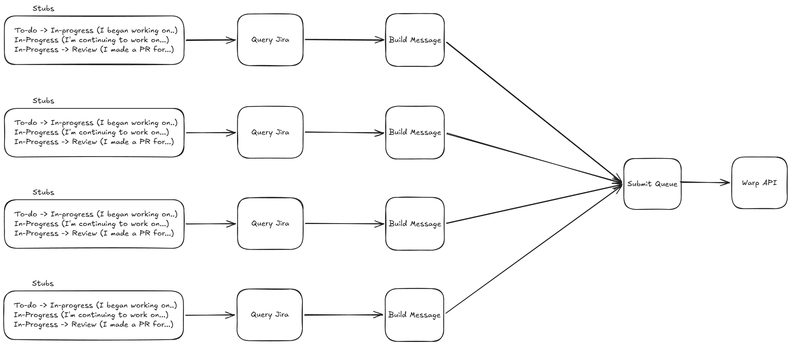

# Design Brainstorming

I'm purely using this to brainstorm ideas for how to structure this application.
This document will not be updated as a 'model of the system' and will likely be
out of date by the time development begins.

## High Level

In a nutshell, this application needs to run a cron job everyday, and submit a
queue of timesheet entries to the warp endpoint. Timesheet entries themselves
will consist of message 'stubs' that read all of the issue information from a
board and then, using the stub message templates, combine them into a message
that can be submitted to Warp's endpoints.

