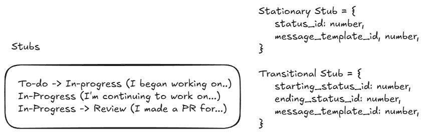
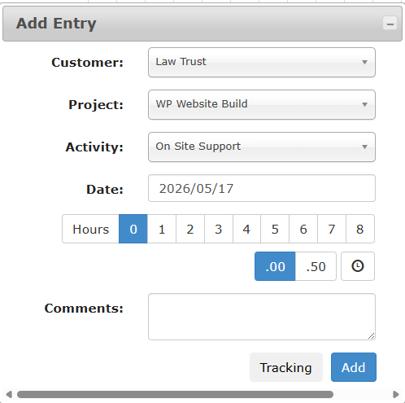

# Design Brainstorming

I'm purely using this to brainstorm ideas for how to structure this application.
This document will not be updated as a 'model of the system' and will likely be
out of date by the time development begins.

## High Level

In a nutshell, this application needs to run a cron job everyday, and submit a
queue of timesheet entries to the warp endpoint. Timesheet entries themselves
will consist of message 'stubs' that read all of the issue information from a
board and then, using the stub message templates, combine them into a message
that can be submitted to Warp's endpoints.

## Stubs

Stubs are essentially a data type that timesheet messages are built from. There
are two kinds: 'stationary' stubs and 'transitional' stubs.

The stub allows for us to programmatically generate timesheet messages by filtering
tickets into these categories and depending on which category they fit, a message template
is used. The filtering is done by using the status field of the ticket. Most project
management software has a concept of 'To-do', 'In-progress', 'Done', etc. We can
use these statuses to create human readable texts explaining what work the employee
has done that day.

The concept of 'stationary' versus 'transitional' is used to further filter by
the _movement_ of the ticket _that day_. For example, if a ticket has moved from
status A: To-do to status B:In-progress then we can use the message template of
"I began working on..." to create a message from all the tickets that match this
criteria.

> "Today I began working on TKT-21 (Refactoring AI Slop) and TKT-22 (Adding Chat Bot)"

For 'stationary' stubs. These are tickets that's condition is that it _remained_
in that position that day. For example, if the condition is that a ticket _remianed_
or was stationary in status "In-progress" then the message we build can matched to
"Today I continued working on.."

> "Today I continued working on TKT-21 (Refactoring AI Slop) and TKT-22 (Adding Chat Bot)"

## Persistance

With stubs, conditions, IDs in mind, it is clear to me that we will need to store
information relates to the 'Board' the user uses because we will need to store
the statuses that their Board uses so that we can map those statuses from the stubs.

So a user should have many boards, and boards should have many statuses.

We will have to maintain a mapping of our internal board ID and the board ID of
the project management software.

Furthermore, a user may have many Warp 'projects'. Ultimately the way this data
is represented is quite messy. The data structure for Warp Projects are as follows:

A 'Customer' can have many projects.

Every single entry also includes an 'activity' which is a fixed list which I
believe internally maps to the `COST_CODE_IDs` field in a timesheet entry. These
activites are the same across all customers and projects. Changing the customer
does change the list of projects but does not change the list of activies so
ultimately we going to map a 'Board' to a 'Project'. The challenge here is that
for the Lumix customer for example, there are different projects that might
be suitable to enter a timesheet entry in to. For example, there is 'Development'
and 'Discovery - Planning and Architecture'. It might be useful to submit tickets
under multiple but I think for now we will just simply go Board -> Warp Project
(which is a child of a customer.)
